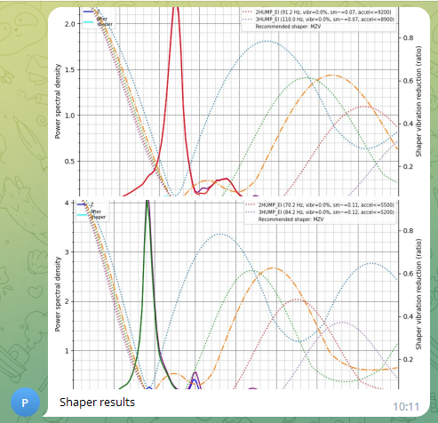

# Advanced bot-oriented macro usage

This document is a reference on how to write useful macros to use with the bot to get the most out of available functionality.
The macros in this document are formatted so that it is possible to cut-and-paste them into your config.

The segments in this file are formatted corresponding to the place, where they will be used.
Macros, bot commands, as well as executables.

## Highlighting

Let's imagine, that you regularly change filament.
You probably have macros to insert and extract filament.

To insert filament, you usually preheat your extruder to some temperature, which is hot enough to push filament through, load the filament, and then extrude some amount of plastic.

We can somewhat improve the workflow and create a shortcut for the second part.

Here are the macros we are going to use:

```jinja2
[gcode_macro FILAMENT_INSERT_PREHEAT]
gcode:
	M109 S250
	RESPOND PREFIX=tgalarm MSG="Preheated, insert filament, run "
	G4 P1000
	RESPOND PREFIX=tgnotify MSG="/FILAMENT_INSERT"

[gcode_macro FILAMENT_INSERT]
gcode:
	M109 S250
	M83
	G1 E100 F250
	M104 S0
```

First, we run the FILAMENT_INSERT_PREHEAT macro, does not matter which way, from your webinterface, from your macro button, type it out in console, whatever floats your boat.

What happens next is very simple - after the extruder has reached the desired temperature, the bot sends two messages to the chat, one with a notification, the other without. It looks like this in the chat:


Telegram automatically highlights things it considers commands for a bot, if the message starts with "/" and does not have spaces. This means, that sending `/FILAMENT_INSERT` produces a clickable shortcut in the chat, which only requires clicking on it, to send the command.

This means, that as soon as we have received the message and inserted the filament, we can then press the "/FILAMENT_INSERT" in the chat, to run the macro with that name, which in turn extrudes the desired amount of plastic and powers down the extruder.


This method works for any macro/multiple macros you wish to run.

## Automating resonance testing

If you use Klipper's built-in accelerometer, and have ever used [resonance testing](https://github.com/Klipper3d/klipper/blob/master/docs/G-Codes.md#test_resonances), you probably wished for a possibility to receive the results directly to your device of choice, and not downloading them by hand from the printer.

Using the [ability to send images](interacting-with-klipper.md#sending-files) this is now reality, and not a dream.
In addition to klipper and the bot, you will need the [G-Code Shell Command Extension](https://github.com/th33xitus/kiauh/blob/master/docs/gcode_shell_command.md). This permits executing shell commands, which is needed to execute the corresponding klipper python script for data processing.

The following G-codes (feel free to adjust them to your needs) have to be present in Klipper:

```jinja2
[gcode_macro measure_resonances]
gcode:
	 #Parse parameters
	
	
	

	 #home if not homed
		G28
	
	TEST_RESONANCES AXIS=X HZ_PER_SEC={ HZ_PER_SEC } POINT={ POSITION_X },{ POSITION_Y },{POSITION_Z}
	TEST_RESONANCES AXIS=Y HZ_PER_SEC={ HZ_PER_SEC } POINT={ POSITION_X },{ POSITION_Y },{POSITION_Z}
	RUN_SHELL_COMMAND CMD=shaper_calibrate
	RESPOND PREFIX=tg_send_image MSG="path=['/home/trident/printer_data/logs/resonances/resonances_x.png', '/home/trident/printer_data/logs/resonances/resonances_y.png'], message='Shaper results'"


[gcode_shell_command shaper_calibrate]
command: bash /home/pi/printer_data/config/shaper_calibrate.sh
timeout: 600.
verbose: True
```

The `` blocks are there for user comfort in the web interface. If you use Fluidd, it recognizes such variables as input fields, so that you can run the shaper with different settings, similarly to how the stock built-in G-code would work.
It also permits calling the macro with parameters from the bot's keyboard, should you so desire.

Shaper_calibrate.sh is located in the printer_data directory, and contains the following code:
(Don't forget to `chmod +x` if you are creating it yourself. )

```bash
#! /bin/bash
OUTPUT_FOLDER=logs/resonances
PRINTER_DATA=home/pi/printer_data
KLIPPER_SCRIPTS_LOCATION=~/klipper/scripts
RESONANCE_CSV_LOCATION=tmp

if [ ! -d  /$PRINTER_DATA/$OUTPUT_FOLDER/ ] #Check if we have an output folder
then
    mkdir /$PRINTER_DATA/$OUTPUT_FOLDER/
fi

cd /$RESONANCE_CSV_LOCATION/

shopt -s nullglob
set -- resonances*.csv

if [ "$#" -gt 0 ]
then
    for each_file in resonances*.csv
    do
        $KLIPPER_SCRIPTS_LOCATION/calibrate_shaper.py $each_file -o /$PRINTER_DATA/$OUTPUT_FOLDER/${each_file:0:12}.png
        rm /$RESONANCE_CSV_LOCATION/$each_file
    done
else
    echo "Something went wrong, no csv found to process"
fi
```

This contraption works in the following way:

1. The macro is called with the desired parameters, homes the axes if needed, and proceeds with standard acceleration testing on both axes.
2. The macro calls the execution of the shell script, which runs Klipper's Python program for each csv file generated. It deletes the csvs afterwards to prevent confusion when running multiple tests one after the other. Output images are placed in a subfolder in the logs folder, so that you can access them easily via the webinterface, if that is needed.
3. The macro finishes by sending both files to your telegram bot. In addition to being easily accessible, the bot can now act as your resonance measurement archive, by searching for your message attached to the picture.
4. (Optional) If you feel like extending that, you can also upload the .csv to telegram as well. Open an issue, if you have an implementation you would like to share.


Have fun and let us know if you can invent some other nifty usages!

## Head movements for timelapsing

The timelapse module does a great job at adding a timelapse to every print without any additional overhead.
However, if you want to optimize your prints towards pretty timelapses, that is also an option.
Our good friend [CODeRUS](https://github.com/CODeRUS) agreed for us to share his work here.

The two macros are used to move the toolhead to the side before taking a picture, and return to the print after it is done. Here are his macros that you can use to replicate his ideas:

```jinja2
[gcode_macro TIMELAPSE_START]
gcode:
  RESPOND PREFIX=timelapse MSG=start

[gcode_macro TIMELAPSE_END]
gcode:
  RESPOND PREFIX=timelapse MSG=stop
  RESPOND PREFIX=timelapse MSG=create

[gcode_macro TIMELAPSE_PAUSE]
gcode:
  RESPOND PREFIX=timelapse MSG=pause

[gcode_macro TIMELAPSE_RESUME]
gcode:
  RESPOND PREFIX=timelapse MSG=resume

[gcode_macro TIMELAPSE_PHOTO]
gcode:
  RESPOND PREFIX=timelapse MSG=photo

[gcode_macro TIMELAPSE_CAPTURE]
variable_delay_before: 500
variable_delay_after: 1500
variable_pause: 0
variable_park: 0
gcode:
  

  TIMELAPSE_PHOTO

  

  
  
  
  
  
  
  

  
  
  

  
  
  

  
  

  G1 E-{retract} F{retract_fspeed}

  
    
  
    
  

  
  PAUSE_BASE
  
  G1 X{park_x} Y{park_y} Z{new_z} F{move_fspeed}
  M400
  
  G4 P{delay_before}
  RESPOND PREFIX=timelapse MSG=photo_and_gcode
  
  G4 P{delay_before}
  RESPOND PREFIX=timelapse MSG=photo
  G4 P{delay_after}
  G1 X{act_x} Y{act_y} Z{act_z} F{move_fspeed}
  G1 E{retract} F{retract_fspeed}
  

  

[gcode_macro TIMELAPSE_RESUME_PRINT]
gcode:
  
  
  G4 P{delay_after}
  BASE_RESUME VELOCITY={travel_speed}

[gcode_macro TIMELAPSE_SET_CAPTURE_PARAMS]
gcode:
  
  SET_GCODE_VARIABLE MACRO=TIMELAPSE_CAPTURE VARIABLE={p|lower} VALUE={params[p]}
  RESPOND MSG="Set {p|lower} to {params[p]}"
  

[gcode_macro TIMELAPSE_SET_PARAMS]
gcode:
  RESPOND PREFIX=set_timelapse_params MSG="{rawparams}"

[gcode_macro TIMELAPSE_SET_NOTIFY_PARAMS]
gcode:
  RESPOND PREFIX=set_notify_params MSG="{rawparams}"
```
