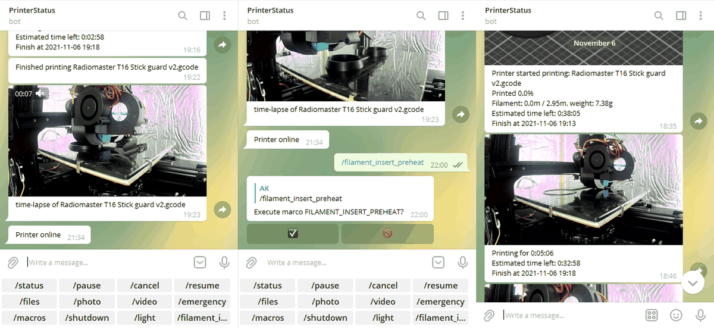

# Moonraker-telegram-bot wiki

## Features

- Printing progress notifications at custom intervals with pictures from a webstream/webcam
- Light control for pictures and videos, configurable delay for camera adjustment
- [Configurable timelapsing](https://youtu.be/gzbzW7Vv2cs)
- Configurable keyboard for easy control without command typing in the bot
- Macro/gcode execution via the bot chat
- Moonraker power device control for PSU/MCU
- Sampling of photos/videos on request at any time
- Pause, Cancel, Resume
- Emergency stop
- Upload g-code files to the chat to print them

## Sample commands available

This is a basic overview of different commands available "out of the box" after installation.
To get an indepth overview over available functionality you can check out the [sample config](sample-config.md) page.
To get a better understanding on how to do useful stuff with the bot, see the [page on klipper interaction](interacting-with-klipper.md) and for ideas on usage check out the [macro](ideas-for-macros.md) page.
Commands can be entered directly in chat, suggested by telegram hightlightning or placed as buttons.

|Command|Description|
|---|---|
|/status|get the status (printing, paused, error) of the printer|
|/pause|pause the current print|
|/resume|resume the current print|
|/cancel|cancel the current print|
|/files|list available G-code files for printing|
|/macros|list all available non-hidden macros|
|/gcode %gcode%|run any gcode command, spaces are supported|
|/%macro_name%|run any macro available on your system|
|/photo|capture a picture from the webstream/webcam|
|/video|capture a video from the webstream/webcam|
|/power|turn off a specified moonraker power device|
|/light|toggle a specified moonraker power device|
|/emergency|run an emergency stop|
|/logs|get logs from klipper, moonraker and the bot as an archive|
|/upload_logs|upload the logs to the [log analyzer](https://github.com/Klipper3d/klipper/blob/master/docs/G-Codes.md#test_resonances) kindly made and provided by [CODeRUS](https://github.com/CODeRUS)|
|/ip| get the private ip of the machine the bot is installed on|
|/bot_restart|restart the bot to apply config changes|
|/shutdown|shut down the host system|

## Installation

Please refer to the [installation instructions](installation.md).
