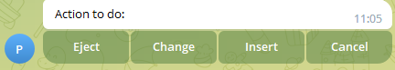
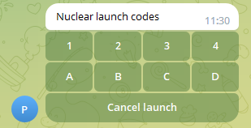

This document is a reference for available interactions between klipper and moonraker-telegram-bot.

**Some interactions are done via "M118"/RESPOND extended commands.**
**You will need to enable the corresponding [section](https://github.com/KevinOConnor/klipper/blob/master/docs/Config_Reference.md#respond) in your printer.cfg file.**

# Interacting with klipper
The commands in this document are formatted so that it is possible to cut-and-paste them into the console or into your macros.

## Running macros from the chat window
You have the possibility to run klipper macros directly from the chat interface in addition to the macros button. Simply type your macro name with a "/" in front of it. Please note, that the macro must be saved in klipper config in upper-case lettering. Calling the macro in the bot can be lower or uppercase. Example usage would be typing `/MY_FAVOURITE_MACRO` or `/my_favourite_macro` into the chat.

This allows you to have a "respond-type" message with pre-typed `/MY_FAVOURITE_MACRO`, allowing you to simply click on it in the chat to respond to a specific action.

While not directly useful on first sight, it opens up some interesting possibilities on automating workflows like filament reloading. See [macro examples](ideas-for-macros.md#highlighting) for more info.


## Running gcode from the chat window
You have the possibility to run any gcode directly from the chat interface.
Simply type `/gcode %your gcode here%` into the chat. Spaces are supported.
Example usage would be typing `/gcode G28 X Y` into the chat.


## Controlling timelapse parameters via gcode
If you have set manual_mode in [timelapse](sample-config.md#timelapse), you can use command to manage timelapse capturing by the bot.
Following commands are available:
- `RESPOND PREFIX=timelapse MSG=photo` Used to capture a single timelapse frame. Can be used with automated mode as well, but might lead to undesired results.
- `RESPOND PREFIX=timelapse MSG=photo_and_gcode` Used to capture a single timelapse frame. Runs the command specified in the config in the "after_photo_gcode" parameter in the `[timelapse]` section after the photo is taken.
- `RESPOND PREFIX=timelapse MSG=start` Marks the beginning of the timelapse capture. Useful, if you want to skip some time before you start the recodring.
- `RESPOND PREFIX=timelapse MSG=stop` Marks the end of the timelapse capture. You can only run "create" after this command. Useful if you want to skip something at the end of the print, like bed extension, or purge operations.
- `RESPOND PREFIX=timelapse MSG=pause` Pauses the automatic capturing. Useful, if you have to run service operations, like switching filament, or if you do not want automated lapse features to run for a reason.
- `RESPOND PREFIX=timelapse MSG=resume` Resumes the automated fcapturing, if it was paused.
- `RESPOND PREFIX=timelapse MSG=create` This starts the rendering of captured pictures to a video file. After the video is done, it is sent to the chat. You might want to run this, while you are not printing, since video-rendering is resource intensive.


## Send custom notifications to the bot.
You can use RESPOND-type commands to send custom messages to the bot.
You have three types of messages:

**1. Notify-Messages**
These messages are ideal for low-importance notifications to the bot. You can configure them not to trigger notification sound on your telegram clients.

- `tgnotify` Sends a new message with/without an alert configured by 'silent_status'.
Intended usage is to send custom status updates to the bot, as "heating done".
An example command, to be sent from gcode or from a macro would be `RESPOND PREFIX=tgnotify MSG=my_message` or `RESPOND PREFIX=tgnotify MSG="my message with spaces"` if you need spaces.
- `tgnotify_photo` Captures a picture, sends a message with an alert configured by 'silent_status'. Works exactly the same as the simple notify command, but also takes a photo from the camera. It respects all the settings from the ```[camera]``` config section. An example command, to be sent from gcode or from a macro would be
`RESPOND PREFIX=tgnotify_photo MSG=my_message` or `RESPOND PREFIX=tgnotify_photo MSG="my message with spaces"` if you need spaces.
- `tgnotify_status` Updates the status message with a line of your choice. You can use it to prevent unwanted message spam, and write any relevant information directly to the status message.
An example command, to be sent from gcode or from a macro would be
`RESPOND PREFIX=tgnotify_status MSG=my_message` or `RESPOND PREFIX=tgnotify_status MSG="my message with spaces"`.
You can get inspiration from Command_templates.md in the klipper documentation for jinja2 templates. This notification type is completely silent and does not generate an additional message.
- `M117` The default g-code for writing to displays in klipper. The bot automatically adds M117-type g-code to the status messages.


**2. Alarm-Messages**
These messages are used for high-priority alerts to the bot. They always trigger an alert on your telegram clients.

- `tgalarm` Sends a message with an alert. You get a "red" notification with sound or vibration.
An example command, to be sent from gcode or from a macro would be `RESPOND PREFIX=tgalarm MSG=my_message` or `RESPOND PREFIX=tgalarm MSG="my message with spaces"` if you need spaces.
- `tgalarm_photo` Captures a picture, sends a message with an alert. You get a "red" notification with sound or vibration.
Works exactly the same as the simple alarm command, but also takes a photo from the camera. It respects all the settings from the ```[camera]``` config section.


**3. Keyboards**
You can send a message with buttons similar to how the confirmation dialogs look like.
These messages respect the configuration of `silent_commands`.
An example command looks like this: `RESPOND PREFIX=tgcustom_keyboard MSG="message='',buttons=[{name='', command=''}]"`
Sadly, due to how jinja/klipper works, you can not send this directly. You first have to assign this to a temporary variable.
We are working on something nicer, but since this is a one-time thing to do in your config, it should not bother too much.
```

RESPOND PREFIX=tgcustom_keyboard MSG="{bot_msg}"
```
This command will generate the following message:


All buttons will be added from left to right, in one row. The buttons can have any name, and can execute commands, in this case macros. Commands like "ACCEPT", "ADJUST", obviously work as well. `command='delete'` deletes the message, and helps cleaning up multiple-message-workflows.
You can also have a multiple-row message, by using a list for every row:
```
	
	RESPOND PREFIX=tgcustom_keyboard MSG="{bot_msg}"
```


We suggest using those messages to automate pause, resume and service workflows.
Examples will follow in the [Ideas for macros](ideas-for-macros.md) document.


## Formatting messages
All configurable messages (status, command, keyboard etc.) support some of the html formatting.
Valid formatting tags are:
`<b></b>` for <b>bold</b>,
`<u></u>` for <u>underlined</u>,
`<i></i>` for  <i>cursive</i>,
`<tg-spoiler></tg-spoiler>` for telegram spoilers,
`<del></del>` for <del>strikethrough</del>,
`<pre></pre>` doubles as `codeblock` and also forces a new line,
`<a href='http://www.example.com/'>inline URL</a>` can be used to insert links. Make sure you use single quotes.

An example message using bold formatting looks the following way:
`RESPOND PREFIX=tgnotify MSG=my_message with <b>bold text</b>`


## Runtime lapse and notification setting

If you want to run specific notifications and lapse settings based on criteria from the slicer, you can issue the following command to the bot:

Parameters for the timelapse give you the option to control settings similarly to the [timelapse](sample-config.md#timelapse)config section:
`RESPOND PREFIX=set_timelapse_params MSG="enabled=[1|0] manual_mode=[1|0] height=0.22 time=18 target_fps=20 min_lapse_duration=5 max_lapse_duration=15 last_frame_duration=10"`

Parameters for the notifications give you the option to control settings similarly to the [progress_notification](sample-config.md#progress_notification) config section:
`RESPOND PREFIX=set_notify_params MSG="percent=5 height=0.24 time=65"`
This run-time setting behaves similarly to klipper - the requested parameters remain consistent until the next restart of the bot.

## Sending arbitrary files by gcode

If you want to cut and process videos yourself, and upload them later, or if you want to [automate resonance testing](ideas-for-macros.md#automating-resonance-testing), or if you have some other obscure usecase we are not aware of, you can use the following gcodes to send an image, video or file:
**Don't forget, that there is a 50mb filesize limit and 10mb limit per image for bots in telegram.**
You can use absolute or relative paths. Relative paths work from the location, where the bot is installed.
In case us used KIAUH for installation, that will be `home/pi/moonraker-telegram-bot/bot`.

Sending an image:
`RESPOND PREFIX=tg_send_image MSG="path='/home/pi/hat.png', message='A man bought this hat and it fits him nicely' "`
This tries to send the image written in `path=`, with the `message=`. Message is optional.
Alternatively, you can send multiple images as an album, by using the following syntaxis:
`RESPOND PREFIX=tg_send_image MSG="path=['/home/pi/hat.png', '/home/pi/his_other_hat.png'], message='Album of hats' "`


Sending a video:
`RESPOND PREFIX=tg_send_video MSG="path='/home/pi/3M-54.mp4', message='Calibration complete!' "`
This tries to send the video written in `path=`, with the `message=`. Message is optional.
Alternatively, you can send multiple videos as an album, by using the following syntaxis:
`RESPOND PREFIX=tg_send_video MSG="path=['/home/pi/3M-54.mp4', '/home/pi/3M-54.1.mp4'], message='Calibration album complete!' "`

Sending a file:
`RESPOND PREFIX=tg_send_file MSG="path='/home/pi/data.zip', message='Upload finished' "`
This tries to send the file written in `path=`, with the `message=`. Message is optional.
Alternatively, you can send multiple files as an album, by using the following syntaxis:
`RESPOND PREFIX=tg_send_file MSG="path=['/home/pi/data_1.zip', '/home/pi/data_2.zip'], message='Upload finished' "`
